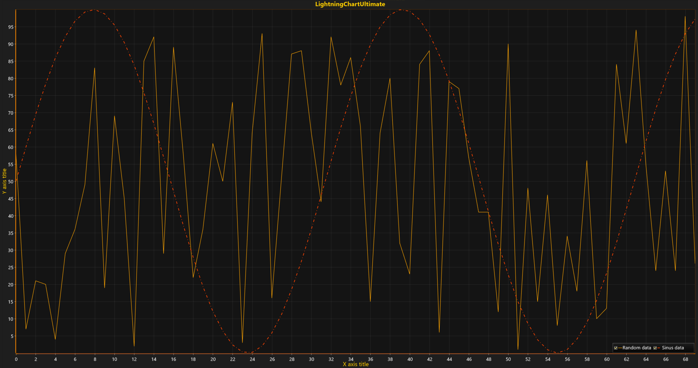

# Multiple Series

Best practice of data visualization within Data Analysis in different fields and industries is combining multiple series in one chart to examine and get richer insight about collected data. Moreover, it allows researchers to make conclusions about the researching phenomena out of each data set, to search patterns and relationships both within a collection and across collections. Modify the previous example and create one additional line.



##### 1. Create line-series, owner, and axes assignment.

   ```cpp
   // New line-series instance is assigned to default X and Y axes.
   var series2 = new PointLineSeries (
       chart.ViewXY,
       chart.ViewXY.XAxes[0],
       chart.ViewXY.YAxes[0]
   );
   ```

##### 2. Prepare data.

   ```csharp
   // Recreate data collection with new algorithm.
   data = new SeriesPoint[pointCounter];

   for (int i = 0; i < pointCounter; i++) { 
       data[i].X = (double)i; 
       data[i].Y = Math.Sin(i * 0.2) * 50 + 50; 
   }
   ```

##### 3. Configure and set options.

   ```csharp
   // Configure line style (e.g. Color, Line thickness and Pattern).
   series2.LineStyle.Color = Color.FromArgb(255, 255, 67, 0); 
   series2.LineStyle.Pattern = LinePattern.DashDot;
   series2.LineStyle.Width = 3;
   series2.Points = data; // Assign data.
   ```

##### 4. Make created line-series a part of a chart.

   ```csharp
   // Add the series into list of point-line-series 
   chart.ViewXY.PointLineSeries.Add(series2);
   ```

### Note!
Any series can be reassigned to any created X and Y axis by configuring properties AssignXAxisIndex for X-axis index assignment and AssignYAxisIndex for Y-axis index assignment.

