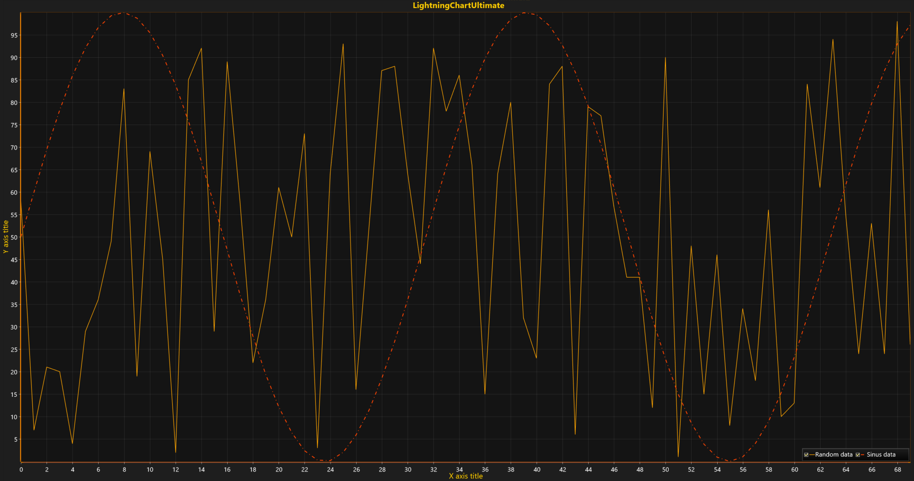

# Multiple Series

Best practice of data visualization within Data Analysis in different fields and industries is combining multiple series in one chart to examine and get richer insight about collected data. Moreover, it allows researchers to make conclusions about the researching phenomena out of each data set, to search patterns and relationships both within a collection and across collections. Modify the code from the previous tutorial [Simple 2D Chart](https://www.arction.com/tutorials/#/lcu_tutorial_simple2Dchart_01) and create one additional line.



##### 1. Generate new data for second series.

```csharp
// Generate new data for second series.
data = new SeriesPoint[pointCounter];

for (int i = 0; i < pointCounter; i++) 
{ 
   data[i].X = (double)i; 
   data[i].Y = Math.Sin(i * 0.2) * 50 + 50; 
}
```

##### 2. Create a new PointLineSeries.

```csharp
// Create another PointLineSeries and set new color and line-pattern for it.
var series2 = new PointLineSeries (chart.ViewXY, chart.ViewXY.XAxes[0], chart.ViewXY.YAxes[0]);
series2.LineStyle.Color = Color.FromArgb(255, 255, 67, 0);
series2.LineStyle.Pattern = LinePattern.DashDot;
series2.Title.Text = "Sinus data";
```

##### 3. Set data-points into series.

```csharp
// 3. Set data-points into series.
series2.Points = data;
```

##### 4. Add series to chart.

```csharp
// Add series to chart.
chart.ViewXY.PointLineSeries.Add(series2);
```

### Note!
Any series can be reassigned to any created X- and Y-axis by configuring properties AssignXAxisIndex for X-axis index assignment and AssignYAxisIndex for Y-axis index assignment. See [Multiple Axes](https://www.arction.com/tutorials/#/lcu_tutorial_multipleAxes_03).

